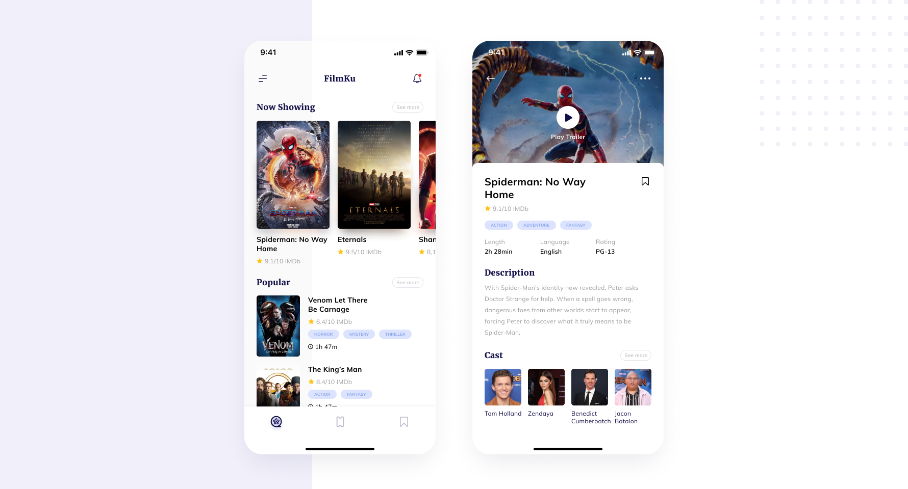

# Movie App

A simple app that provides movie information from <a href="https://developers.themoviedb.org/3/getting-started/introduction" rel="nofollow">TMDB API</a> .
   
### Features:
<ul>  
  <li>Now Showing</li>
  <li>Popular</li>
  <li>Movie Detail</li>
  <li>Movie Trailer</li>
</ul>

### Run the app:
1. Run `flutter pub get`
2. Run `flutter pub run build_runner build --delete-conflicting-outputs`
3. Get API key from https://developers.themoviedb.org/3/getting-started/introduction
4. Run `cp ./env/.env.example ./env/.env` at root folder to setup env file & set api key
5. Run `flutter run`

### Screens:
Design is not mine, credit <a href="https://www.figma.com/community/file/1054431643740926668" rel="nofollow">this</a> 
  
This app contains two screens, Main screen that display now showing & popular movies and Movie Detail Screen.
 
 

